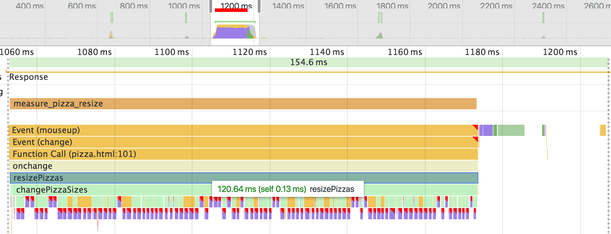
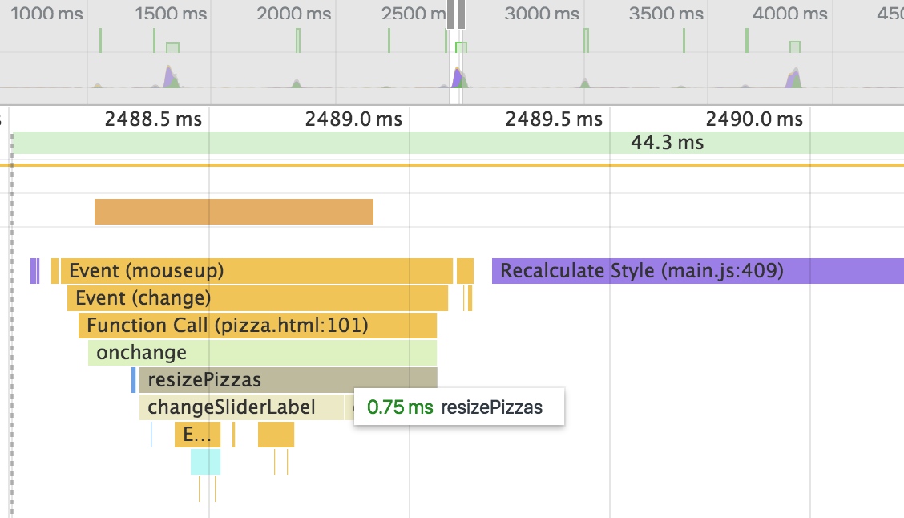

# Website Optimization (Udacity Front-end Nonodegree Project)
---
This project is to optimize a portfolio website with a number of optimization- and performance-related issues so that it achieves a target PageSpeed score 90+ and runs at 60 frames per second. Optimizations were made to the index.html file and main.js.

## Getting started

 1. Repo or download the [file](https://github.com/weekendchow/MoZhou-frontend-nanodegree-mobile-portfolio.git) to local machine. 
 2. Run a local server
```sh
$ cd /path/to/your-project-folder
$ python -m SimpleHTTPServer 8080
```
 3. Open a browser and visit localhost:8080
 4. Download and install [ngrok](https://ngrok.com/) to the top-level of your project directory to make your local server accessible remotely.
```sh
$ cd /path/to/your-project-folder
$ ./ngrok http 8080
```
- ##### PageSpeed Score
Copy the public URL ngrok gives you and try running it through PageSpeed Insights! 
- ##### Getting Rid of Jank
Open Chrome Developer Tools to do the performence testing to check the frame-rate and Resize time.

## PageSpeed Score (90+)
### Critical Rendering Path (index.html)

| Mobile | Desktop | Action |
| ------ | ------ | ------ |
| 27 | 29 | original |
| 77 | 90 | minified css, js and compressed images |
| 87 | 93 | added async to the Google analytics script／put GoogleAnalytics script to the bottom/use webfont to load font at the bottom/added media="print" to print.css/  |
| 95 | 96 | inlined style.css |

## Getting Rid of Jank (main.js)
### Frame Rate (Consistent 60 fps when scrolling )
For the original version each frame takes about 50 ms which is around 20 fps.

After applied following changes, the speed achieve consistent 60 fps when scrolling.

- Replaced `querySelectorAll` with `getElementsByClassName` and moved out of the function.
- Replaced `querySelector` with `getElementById` and moved out of the loop.
- Moved phase calculation into its own loop and appended to an array.
- Adjusted the number of pizzas from 200 to the number based on the window height. 
- Added `will-change: transform;` to style.css.

### Computational Efficiency (Resize time < 5 ms)
For the original version, it takes 120 ms to resize the pizza.
 
After applied following changes, the Resize time drop to less than 1 ms.
 
- Elimanate function `determineDx`
- Rewrite `changePizzaSizes` function and combine with function `sizeSwitcher`
- Replaced `querySelectorAll` with `getElementsByClassName` and moved out of the loop.

## License

This project is licensed under the MIT License - see the [LICENSE.md](LICENSE.md) file for details
